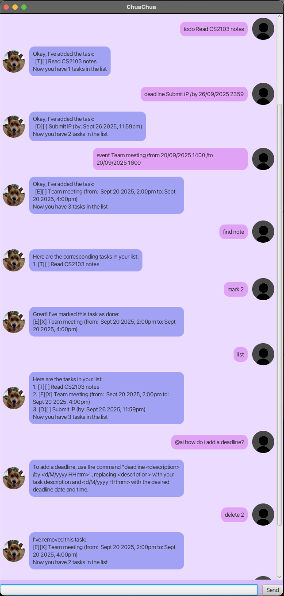

# ChuaChua User Guide

ChuaChua is a lightweight task management application designed for users who prefer typing commands efficiently while still benefiting from a clean graphical interface.

It supports:
- Todo Tasks
- DeadLine Tasks
- Event Tasks
- Automatic sorting by deadline
- Keyword Search
- AI-assisted help

## Features
### Adding a ToDo
Adds a task without a deadline\
Format: `todo <description>`\
Example: `todo Read CS2103 notes`

### Adding a Deadline
Adds a task with a deadline\
Format: `deadline <description> /by <d/M/yyyy HHmm>`\
Example: `deadline Submit iP /by 26/09/2025 2359`

### Adding an Event
Adds a task with a start and end time.\
Format: `event <description> /from <d/M/yyyy HHmm> /to <d/M/yyyy HHmm>`\
Example: `event Project meeting /from 20/09/2025 1400 /to 20/09/2025 1600`

### Listing Tasks
Tasks are automatically sorted by increasing deadline.
- ToDo appeads first
- Deadlines are sorted by date/time
- Events are sorted by start date/time
- Indexes are updated according to latest sorted order\
Format: `list`

### Marking/Unmarking a Task
Marks a Task as completed/incomplete.\
Format: `mark <task_number>` or `unmark <task_number>`

### Deleting a Task
Deletes a Task from the list.\
Format: `delete <task_number>`

### Finding Tasks
Finds all tasks that cintains a keyword\
Format: `find <keyword>`

### AI-assisted help
Provides AI-generated assistance about supported commands.\
Format: `@ai <query>` \
Example:
`
@ai how do i add a deadline?
`

